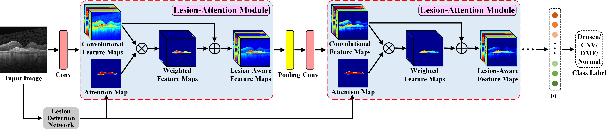

## *Trustworthy AI, Explainable AI*

## *Machine Learning, Computer Vision*

## *Medical Image Analysis, AI for Healthcare*

> Segmentation of 3D bowel structure with full and partial label supervision.
>

> Diagnosis of retinal diseases with lesion-related domain knowledge. 

