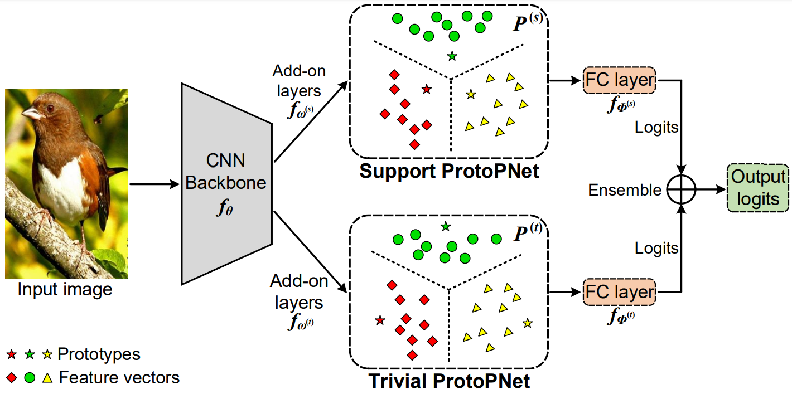
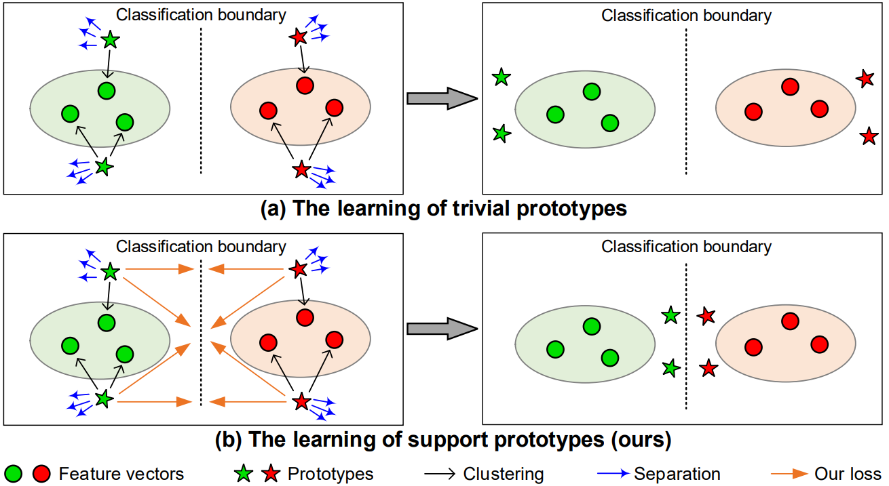
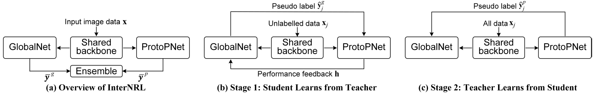
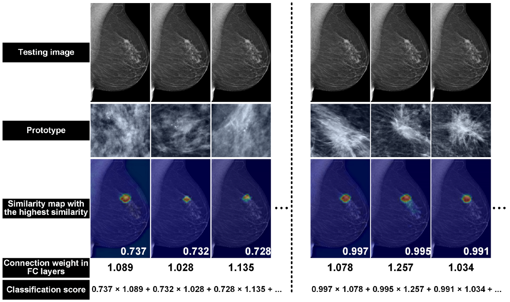

## *Trustworthy AI, Computer Vision*

> Deep model interpretability with visual prototypes.
>  >

## *Medical Image Analysis, AI for Healthcare*

> Interpretable and accurate disease diagnosis with reciprocal learning.
>
>

> Segmentation of 3D bowel structure with full and partial label supervision.
>

> Diagnosis of retinal diseases with lesion-related domain knowledge. 

