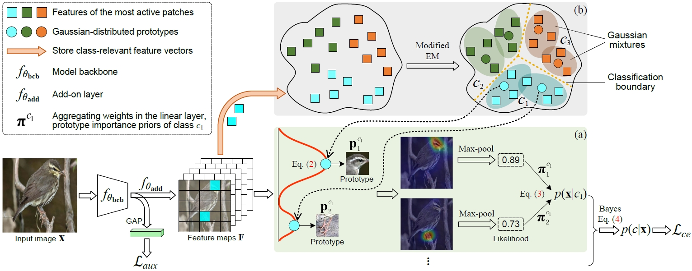

<!-- ## *Trustworthy AI, Computer Vision* -->

## *Trustworthy Machine Learning*

> Mixture of Gaussian-distributed prototypes with generative modelling.
>

> Deep model interpretability with support and trivial prototypes.
>

## *Medical Image Analysis, AI for Healthcare*
> Interpretable and accurate disease diagnosis with reciprocal learning.
>

> Segmentation of 3D bowel structure with full and partial supervision.
>

> Diagnosis of retinal diseases with lesion-related domain knowledge. 

